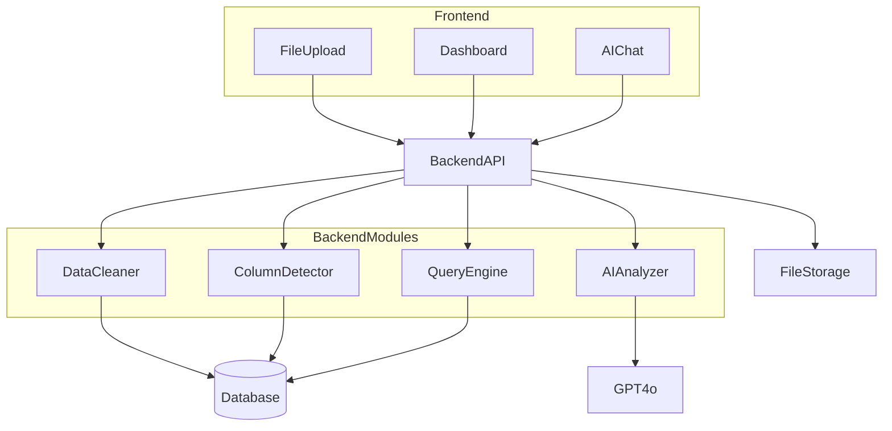
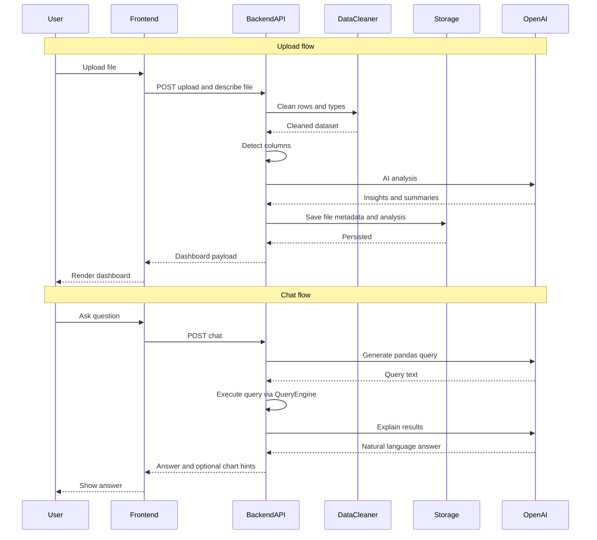
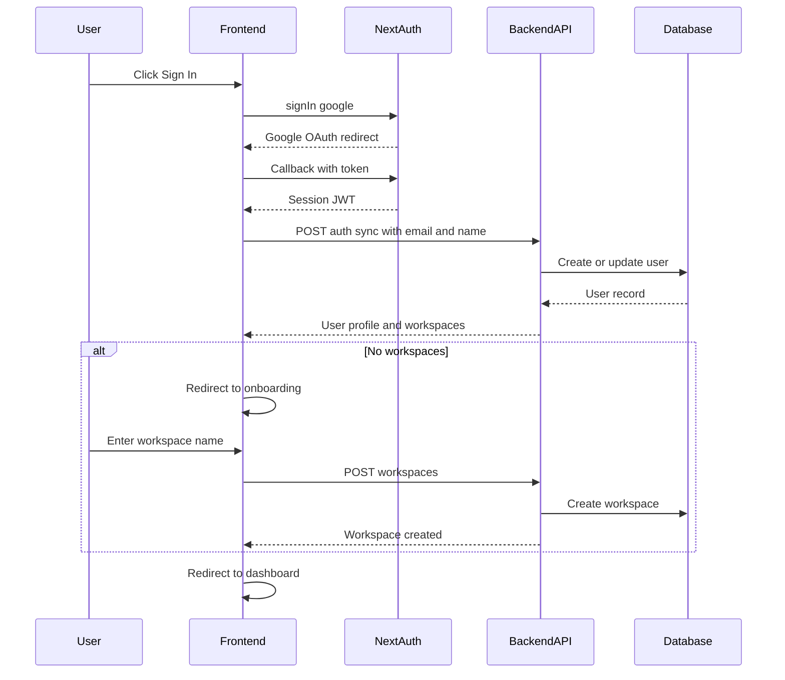

# Excel Consultant — Architecture

## Overview

Users upload Excel or CSV files; the platform ingests and cleans the data, runs AI-driven analysis, and surfaces results in auto-generated dashboards. Natural-language chat answers questions over the dataset using generated queries and explanations. The system is built with **Next.js** (frontend), **FastAPI** (backend), and **OpenAI** models for analysis and chat.

## Tech Stack

- **Frontend:** Next.js 14+ (App Router), TypeScript, Tailwind CSS, shadcn/ui, Recharts, TanStack Query
- **Backend:** FastAPI, Python 3.11+, Pandas, OpenAI GPT-4o, SQLAlchemy
- **Database:** SQLite (dev) / PostgreSQL (prod)
- **Storage:** Local filesystem (dev) / S3 (prod)
- **Deployment:** Vercel (frontend), Railway (backend)

## Architecture Diagram



## Data Flow



## Authentication Flow



## Database Schema

| Table | Purpose |
|-------|---------|
| **users** | User accounts synced from Google OAuth: email, name, image, active workspace. |
| **workspaces** | Isolated containers for user data: name, owner. |
| **uploads** | Original file records: path/URL, size, MIME type, status, timestamps. Scoped to workspace. |
| **datasets** | Logical dataset per upload: schema snapshot, column metadata, row counts. |
| **analyses** | AI analysis runs: prompts, model, structured output, links to dataset. |
| **dashboards** | Dashboard definitions: layout, widget specs, bindings to analysis/dataset. |
| **chat_messages** | Chat history: role, content, optional tool/query traces, dataset scope. |
| **dataset_relations** | Joins or links between datasets (e.g. keys, relationship type). Scoped to workspace. |

## API Endpoints

| Method | Path | Description |
|--------|------|-------------|
| `GET` | `/health` | Liveness/readiness for load balancers. |
| `POST` | `/api/auth/sync` | Sync user from NextAuth session (create or update). |
| `GET` | `/api/auth/me` | Get current user profile + workspaces. |
| `POST` | `/api/workspaces` | Create a new workspace. |
| `GET` | `/api/workspaces` | List workspaces for current user. |
| `POST` | `/api/workspaces/{id}/activate` | Set active workspace. |
| `POST` | `/api/uploads` | Create upload; accept file + optional description. |
| `GET` | `/api/uploads/{id}` | Upload metadata and processing status. |
| `GET` | `/api/datasets` | List all datasets (workspace-scoped). |
| `GET` | `/api/datasets/{id}` | Dataset profile and column info. |
| `GET` | `/api/datasets/{id}/preview` | Paginated sample rows for UI preview. |
| `POST` | `/api/analysis/run` | Trigger AI analysis for a dataset. |
| `GET` | `/api/analysis/{id}` | Fetch a completed analysis by id. |
| `POST` | `/api/chat` | Natural-language Q&A over a dataset. |
| `GET` | `/api/dashboards/{id}` | Dashboard configuration and data bindings. |
| `GET` | `/api/relations/detect` | Auto-detect relations across datasets. |
| `GET` | `/api/relations` | List all detected relations. |

## Project Structure

### `frontend/`

```text
frontend/
├── src/
│   ├── app/
│   │   ├── layout.tsx
│   │   ├── page.tsx              # Landing page
│   │   ├── login/page.tsx        # Google OAuth sign-in
│   │   ├── onboarding/page.tsx   # First-time workspace creation
│   │   ├── api/auth/[...nextauth]/route.ts
│   │   └── (dashboard)/
│   │       ├── layout.tsx        # Auth guard + sidebar + workspace switcher
│   │       ├── upload/page.tsx
│   │       ├── datasets/page.tsx
│   │       ├── datasets/[id]/page.tsx
│   │       └── chat/page.tsx
│   ├── components/
│   │   ├── ui/                   # shadcn primitives
│   │   ├── charts/               # Recharts wrappers
│   │   ├── upload/               # File upload + context form
│   │   ├── auth-guard.tsx        # Route protection
│   │   ├── user-menu.tsx         # User avatar + sign out
│   │   └── workspace-switcher.tsx
│   └── lib/
│       ├── api.ts                # Backend API client (auto-attaches user header)
│       ├── auth.ts               # NextAuth config
│       ├── providers.tsx         # Session + Query + Workspace providers
│       ├── workspace-context.tsx # Workspace state management
│       └── utils.ts
├── .env.local.example
├── package.json
└── tailwind.config.ts
```

### `backend/`

```text
backend/
├── main.py                     # FastAPI entry point
├── config.py                   # Settings via pydantic-settings
├── database.py                 # SQLAlchemy engine + session
├── deps.py                     # Auth dependencies (get_current_user, require_user)
├── routes/
│   ├── auth.py                 # User sync + profile
│   ├── workspaces.py           # Workspace CRUD + activation
│   ├── uploads.py
│   ├── datasets.py
│   ├── analysis.py
│   ├── dashboards.py
│   ├── chat.py
│   └── relations.py
├── services/
│   ├── file_processor.py       # Parse Excel/CSV
│   ├── data_cleaner.py         # Clean + normalize
│   ├── column_detector.py      # Type + name heuristic detection
│   ├── ai_analyzer.py          # OpenAI analysis
│   ├── query_engine.py         # Chat: question -> pandas -> answer
│   ├── forecaster.py           # Linear regression forecasting
│   └── relation_detector.py    # Cross-dataset relation detection
├── models/
│   └── models.py               # SQLAlchemy models (User, Workspace, Upload, ...)
├── schemas/
│   └── schemas.py              # Pydantic request/response schemas
├── data/                       # SQLite DB + uploaded files (dev)
└── requirements.txt
```

## Future Roadmap

**Analytics**

- Prophet (or similar) forecasting on time series
- Custom metrics and KPI builder
- What-if and scenario modeling
- Comparative intelligence across periods or segments
- Industry benchmarking (where data allows)
- Anomaly detection and alerting

**Collaboration**

- Team workspaces and roles
- Shareable dashboards and links
- Scheduled email/PDF reports
- Comments and annotations on widgets

**Platform**

- Drag-and-drop dashboard builder
- Google Sheets import
- PDF table extraction
- Tally / Zoho (and similar) integrations
- Hindi and regional-language summaries
- Background jobs with Celery and Redis
- S3 assets behind a CDN for scale
