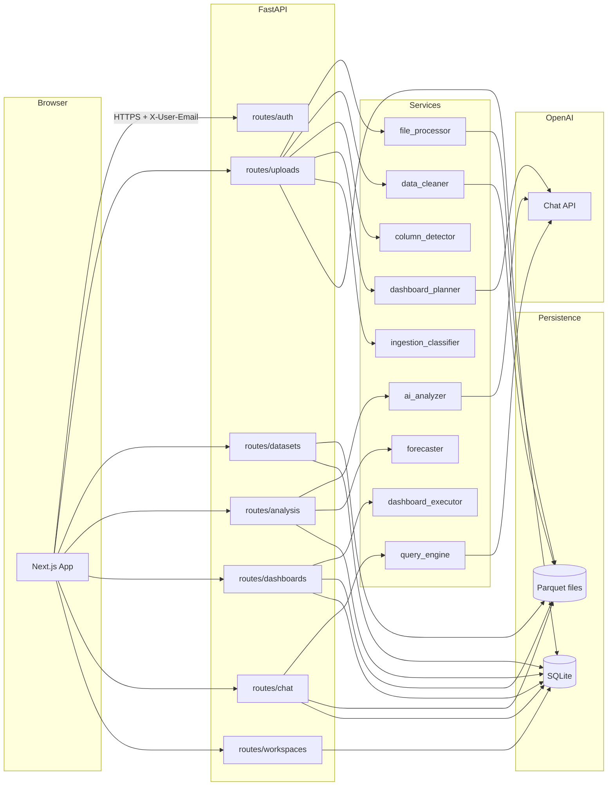

# Clarus / Excel Consultant — Architecture & Deep Dive

This document is the **authoritative technical map** of the project: how data moves, where it lives, which APIs exist, and how AI is used. Use it to onboard, debug, or answer stakeholder questions.

---

## 1. Product mental model (one paragraph)

Users sign in with Google, pick a **workspace** (isolated container), and upload **tabular files** (Excel/CSV/TSV). The backend **cleans** rows, **infers column roles** (date, revenue-like, category, etc.), stores **metadata in SQLite** and **cleaned rows as Parquet on disk**, and optionally builds a **dashboard plan** (KPIs + charts). The UI shows **per-dataset** dashboards, **AI briefings** (structured JSON from the model), **workspace overview** (rollup KPIs/charts + optional workspace-level briefing), **linear forecasts**, and **chat** that turns questions into **pandas code** executed safely on the DataFrame.

---

## 2. Tech stack (as implemented)

| Layer | Technology |
|--------|------------|
| Frontend | Next.js (App Router), React 19, TypeScript, Tailwind CSS v4, shadcn/ui (Base UI), TanStack Query, Recharts, next-themes |
| Auth | NextAuth.js (Google provider); session in browser |
| Backend | FastAPI, SQLAlchemy, Pandas, PyArrow/Parquet, OpenAI Python SDK |
| Database | SQLite by default (`DATABASE_URL`); PostgreSQL-compatible via SQLAlchemy URL |
| File storage | Local directory `UPLOAD_DIR` (default `./data/uploads`); original file + `{upload_id}_cleaned.parquet` |
| AI | OpenAI chat completions (`OPENAI_MODEL`, default `gpt-4o`); JSON responses for analysis and chat pipeline |

Deployment targets mentioned in older docs (Vercel/Railway) are **not enforced in code**—configure via hosting.

---

## 3. High-level system diagram

---

## 4. Authentication & workspace scoping

### 4.1 Frontend

1. User signs in with **Google** via NextAuth (`frontend/src/lib/auth.ts`, `app/api/auth/[...nextauth]/route.ts`).
2. After session exists, `WorkspaceProvider` (`frontend/src/lib/workspace-context.tsx`) calls **`POST /api/auth/sync`** with `{ email, name, image }`.
3. Sync response includes `workspaces`, `active_workspace_id`, and `needs_onboarding` (true when user has zero workspaces).
4. `setApiUserEmail` (`frontend/src/lib/api.ts`) stores the email so **every subsequent API call** sends header **`X-User-Email: <email>`**.

### 4.2 Backend

- `deps.get_current_user` reads **`X-User-Email`**, loads `User` from DB (no JWT validation on API—**trust boundary is the frontend + network**).
- `deps.require_user` → 401 if missing user.
- `deps.require_active_workspace` → 400 if user has no `active_workspace_id` or workspace is not owned by user.

**Implication:** The API is **not** a public internet API without an additional gateway; it assumes the same user controls the browser that sets the header.

### 4.3 Workspace rules

- All dataset/upload/dashboard/chat/analysis operations (except a few read helpers) use **`require_active_workspace`** so rows are **scoped to the active workspace**.
- Join path: `Upload.workspace_id` → `Dataset.upload_id`. Listing datasets uses `dataset_upload_pairs_for_workspace` (`backend/services/workspace_query.py`).

---

## 5. Persistence: database schema

ORM: `backend/models/models.py`.

| Table | Role |
|-------|------|
| **users** | `email` (unique), `name`, `image`, `active_workspace_id` (FK logical to workspaces) |
| **workspaces** | `name`, `owner_id` → users |
| **uploads** | Original file metadata: `filename`, `file_type`, **`file_url` (absolute path to saved file)**, `user_description`, `status`, row/column counts, **`workspace_id`** |
| **datasets** | One per successful upload: `name`, **`schema_json`** (column detector output), **`data_summary`** (aggregates JSON), **`cleaned_report_json`**, **`dashboard_plan_json`** (optional AI/heuristic plan), **`business_classification`** (ingestion classifier id) |
| **analyses** | Each run: `dataset_id`, `type` (`overview` = per-dataset briefing, **`workspace_overview`** = whole-workspace briefing—see §7.4 quirk), `result_json`, `ai_summary` |
| **dashboards** | Table exists; not all features may be driven from UI—check routes if extending |
| **chat_messages** | Persists `user` / `assistant` turns per `dataset_id` (even workspace chat stores under a dataset in multi-df path—see chat route) |
| **dataset_relations** | Cross-dataset link metadata; **backend routes exist**; **frontend does not call relations APIs today** |
| **workspace_recurring_summaries** | Workspace-scoped **weekly** / **monthly** executive digests: `period_start`/`period_end`, JSON **`content_json`** (headline, key changes, risk, opportunity, actions), **`email_html_snapshot`** + **`email_sent_at`** reserved for future transactional email (no sender implemented yet); unique on `(workspace_id, kind, period_start)` |
| **workspace_timeline_snapshots** | Append-only **history** for the workspace: `event_type` (`upload` \| `briefing` \| `append`), optional **`ref_id`** / **`dataset_id`**, **`metrics_json`** (row totals + revenue KPI extracts), optional **`themes_json`** (briefing headlines / theme buckets for recurrence); one-time **backfill** on startup fills missing rows from existing uploads and `workspace_overview` analyses |

**Migrations:** `main.py` lifespan runs `create_all` plus small SQLite `ALTER TABLE` backfills for `dashboard_plan_json` and `business_classification`, and a one-time heuristic to set `uploads.workspace_id` for legacy NULLs.

---

## 6. Persistence: filesystem

Under `UPLOAD_DIR` (default `backend/data/uploads/`):

| File | Purpose |
|------|---------|
| `{upload_id}{ext}` | Original upload (e.g. `.csv`) |
| `{upload_id}_cleaned.parquet` | **Canonical working copy** for dashboards, chat, forecast, append |

Almost all analytics **reload Parquet**, not the original Excel, so cleaning steps are stable.

---

## 7. Core pipelines (step-by-step)

### 7.1 Upload → dataset (happy path)

**API:** `POST /api/uploads/` (multipart: `file`, `description`). Responses: **413** over size cap, **429** when rate-limited.

**Steps (`backend/routes/uploads.py`):**

1. Per-user **rate limit** (`upload_rate_limit`), then validate extension against `settings.ALLOWED_EXTENSIONS` (`.xlsx`, `.xls`, `.csv`, `.tsv`).
2. Create `Upload` row (`processing`), stream bytes to `{upload_id}{ext}` with a hard stop at `MAX_FILE_SIZE_MB` (discard row + file if exceeded).
3. `FileProcessor.read` → Pandas DataFrame.
4. `DataCleaner.clean` → cleaned `df` + `clean_report` (steps, shapes).
5. `ColumnDetector.detect` → `metadata` (lists: `date_columns`, `revenue_columns`, `category_columns`, `numeric_columns`, `text_columns`).
6. `ColumnDetector.summary` → numeric aggregates (e.g. `{col}_total`, `{col}_mean`, top category counts) stored as **`data_summary`** JSON.
7. `DashboardPlanner.build_plan` → JSON plan (KPIs + charts + optional `dataset_brief`); may call OpenAI when configured.
8. `build_ingestion_profile` → UI-facing **`ingestion`** object (classification, flags, interpretations).
9. Save `Dataset` with JSON fields; `df.to_parquet` cleaned file.
10. Commit; return `dataset_id`, `ingestion`, `all_columns`, etc.

**Frontend:** `FileDropzone` → `api.uploadFile` → review cards → `PATCH /api/datasets/{id}` to set `business_classification`, primary date/amount, segment columns (updates schema + may rebuild plan—see `datasets.py`).

### 7.2 Per-dataset dashboard (KPIs + charts)

**API:** `GET /api/dashboards/dataset/{dataset_id}?start_date=&end_date=&last_n_days=`

**Flow (`backend/routes/dashboards.py` + services):**

1. Load Parquet; parse `schema_json`.
2. Optional **date filter**: `last_n_days` anchors on **max date in file** (not wall-clock “today”).
3. If `dashboard_plan_json` exists and has charts → **`execute_plan`** builds KPIs + chart payloads from the (possibly filtered) `df`.
4. Else → **`legacy_charts`** + **`fallback_ui_kpis`**.
5. Response includes `filtered_row_count`, `timeframe` meta, `date_bounds`, `daily_aggregates`, etc.

**Frontend:** Dataset page `Overview` tab; `TimeframeToolbar` maps presets to query params (`frontend`).

### 7.3 Per-dataset AI briefing

**API:** `POST /api/analysis/run` body `{ "dataset_id": "..." }`  
**Fetch latest:** `GET /api/analysis/dataset/{dataset_id}`

**Flow (`backend/routes/analysis.py` + `services/ai_analyzer.py`):**

1. Load `data_summary` + `schema_json` + optional `user_description`.
2. **`AIAnalyzer.analyze`** sends statistical summaries to the model with a strict **JSON-only** system prompt (executive summary, `top_priorities`, `key_metrics`, `insights`, `anomalies`, `recommendations`).
3. If `OPENAI_API_KEY` is empty → **`_fallback_analysis`** heuristic JSON (no model).
4. Persist `Analysis` with `type="overview"`.

**Frontend:** `AnalysisPanel` normalizes and renders signals, conviction, trace UI (`frontend/src/components/dashboard/analysis-panel.tsx`, `analysis-normalize.ts`).

### 7.4 Workspace overview AI (quirk)

**API:** `POST /api/analysis/overview/run`  
**Latest:** `GET /api/analysis/overview/latest`

**Flow:**

1. Load **all** datasets in workspace; merge each `data_summary` into `combined_summary.datasets[]`.
2. Merge column lists in `combined_metadata` (concatenation of names—**not** a SQL join).
3. Call **`AIAnalyzer.analyze`** with workspace-level description string.
4. **Storage quirk:** `Analysis` row uses `type="workspace_overview"` but **`dataset_id` is set to the first dataset’s id** in the loop (implementation detail for ORM constraint). The UI treats this as workspace-scoped via `overview/latest`, not via `dataset_id`.

### 7.5 Forecasting

**Per dataset:** `POST /api/analysis/forecast` — loads Parquet, picks `date_column` / `value_column` from request or first entries in `schema_json`, runs **`Forecaster.forecast`** (linear regression, bands).

**Workspace outlook:** `POST /api/analysis/overview/forecast` — picks the **largest dataset by row count** that has both date and revenue columns; uses **first** date + **first** revenue column of that schema.

### 7.6 Chat (natural language → pandas → explanation)

**Single dataset:** `POST /api/chat` `{ dataset_id, question }`  
**Workspace:** `POST /api/chat/workspace` `{ question }`

**Flow (`services/query_engine.py`):**

1. Load prior **`chat_messages`** for this thread (single-dataset vs workspace threads are separated: workspace user lines are stored with prefix **`[All Datasets] `** on the anchor dataset). Up to **12** prior (user, assistant) pairs feed into the model as conversation context.
2. Load Parquet(s); build schema description for the model.
3. **Pass 1:** Model returns JSON with `pandas_code` assigning to `result` (messages include prior Q&A + fresh schema block on the latest user turn).
4. **Safety:** forbidden tokens (`import`, `exec`, etc.) rejected; code run in restricted namespace with **`SAFE_BUILTINS`** + `df` (or multiple `df_*` / `datasets` dict for workspace).
5. **Pass 2:** Model explains result JSON → `answer` and optional `chart_data` (includes a trimmed slice of prior turns).
6. New user + assistant rows appended to **`chat_messages`**.

If no API key, chat degrades (engine checks `self.client`).

---

## 8. AI components compared

| Component | Input | Output | Model role |
|-----------|--------|--------|----------------|
| **AIAnalyzer** | `data_summary` dict, `schema_json` dict, optional text | Single JSON object (briefing) | One structured JSON response |
| **DashboardPlanner** | DataFrame + metadata + stats (+ description) | `dashboard_plan_json` | When `OPENAI_API_KEY` is set, calls chat completions (`OPENAI_MODEL`) for KPI/chart JSON; otherwise **heuristic** plan in code |
| **QueryEngine** | Question + DataFrame(s) + schema + optional **chat history** | `answer`, optional `chart_data` | **Two-step:** codegen JSON → execute → explain JSON; both steps see prior turns |
| **Forecaster** | DataFrame + columns | Historical fit + forward points + stats | **No LLM**; numeric linear regression |

Prompt tone for briefing is controlled in **`backend/services/ai_analyzer.py`** (`SYSTEM_PROMPT`).

---

## 9. API catalog (concrete paths)

Prefix **`/api`** unless noted. Almost all require **`X-User-Email`** + active workspace (see §4).

### Auth & workspace

| Method | Path | Notes |
|--------|------|--------|
| POST | `/api/auth/sync` | Body: email, name, image — creates user, returns profile |
| GET | `/api/auth/me` | Profile + workspaces |
| POST | `/api/workspaces` | Create workspace |
| GET | `/api/workspaces` | List |
| POST | `/api/workspaces/{id}/activate` | Sets `user.active_workspace_id` |

### Uploads & datasets

| Method | Path | Notes |
|--------|------|--------|
| POST | `/api/uploads/` | Multipart upload + process; **413** if file exceeds `MAX_FILE_SIZE_MB`; **429** if per-user rate limits exceeded |
| GET | `/api/uploads/{id}` | Metadata |
| GET | `/api/datasets` | List in workspace |
| GET | `/api/datasets/{id}` | Schema, summary, cleaning report |
| PATCH | `/api/datasets/{id}` | Classification + primary columns + segments |
| GET | `/api/datasets/{id}/preview` | Sample rows |
| POST | `/api/datasets/{id}/append` | Append compatible file; rewrite Parquet; same **413** / **429** rules as `POST /api/uploads/` |
| DELETE | `/api/datasets/{id}` | Remove dataset + related rows/files per route logic |

### Analysis & dashboards

| Method | Path | Notes |
|--------|------|--------|
| POST | `/api/analysis/run` | Per-dataset briefing |
| GET | `/api/analysis/dataset/{dataset_id}` | Latest analysis or null |
| GET | `/api/analysis/{analysis_id}` | By id (less used from UI) |
| POST | `/api/analysis/forecast` | Per-dataset forecast |
| POST | `/api/analysis/overview/run` | Workspace briefing |
| GET | `/api/analysis/overview/latest` | Latest workspace briefing |
| POST | `/api/analysis/overview/forecast` | Workspace outlook chart data |
| GET | `/api/dashboards/dataset/{dataset_id}` | KPIs + charts + timeframe + **`what_changed`** (current vs previous window; respects `last_n_days` / `start_date` / `end_date`) |
| GET | `/api/dashboards/overview` | Cross-dataset KPIs + charts; **`what_changed`** …; **`alerts`** …; **`recommended_actions`** …; **`habit_hints`** …; **`usage`** (plan label, monthly analysis/upload meters, history-depth summary, soft upgrade **`nudges`**) |
| GET | `/api/summaries/latest` | Active workspace; query `ensure` (default true) creates missing digests for **last full ISO week** and **prior calendar month**; returns stored **`weekly`** / **`monthly`** payloads + email-prep fields |
| GET | `/api/summaries/history?kind=&limit=` | Past stored summaries for comparison |
| POST | `/api/summaries/generate` | Body `{ "kind": "weekly"\|"monthly", "force": bool }` rebuilds the canonical period |
| GET | `/api/workspace/timeline` | Timeline events (newest first), **`evolution`** (recurring briefing themes, improving KPIs vs prior snapshot), and **`digests`** (stored weekly/monthly summary headlines) |
| GET | `/api/workspace/timeline/compare` | Query `from` / `to` snapshot ids → row delta + overlapping KPI % changes |

### Chat

| Method | Path | Notes |
|--------|------|--------|
| POST | `/api/chat` | Single dataset; uses prior non–workspace messages on same `dataset_id` |
| POST | `/api/chat/workspace` | Multi-dataset; prior turns stored on first dataset with `[All Datasets] ` user prefix |
| GET | `/api/chat/history/{dataset_id}` | Optional query `workspace=true` for workspace-only thread; requires workspace membership |

### Billing (Razorpay)

| Method | Path | Notes |
|--------|------|--------|
| POST | `/api/billing/razorpay/checkout` | Body `{ "tier": "starter" \| "pro" }`; requires `X-User-Email`. Returns `{ key_id, subscription_id, short_url }` (`key_id` + `subscription_id` drive Razorpay Standard Checkout on `/pricing`; `short_url` is fallback). Otherwise **503**. |
| POST | `/api/billing/razorpay/verify-checkout` | After successful Checkout: body `{ razorpay_payment_id, razorpay_subscription_id, razorpay_signature }`; requires `X-User-Email`. Confirms HMAC per [Razorpay subscription verification](https://razorpay.com/docs/payments/subscriptions/integration-guide/#payment-verification); `subscription_id` must match `user.billing_subscription_id`. Returns `{ verified: true }` or **400**. |
| POST | `/api/billing/razorpay/webhook` | **No auth.** Raw POST body + `X-Razorpay-Signature` (HMAC-SHA256 with `RAZORPAY_WEBHOOK_SECRET`). Use `X-Razorpay-Event-Id` (or payload `id`) for idempotency in `billing_webhook_events`. Subscription **activated** / **charged** / **resumed** (status `active`) sets `subscription_plan` from notes or plan id; **cancelled** / **completed** / **halted** / **expired** downgrades to `free`. |

### Other

| Method | Path | Notes |
|--------|------|--------|
| GET | `/health` | No auth |
| — | `/api/relations/*` | Implemented in backend; **no frontend usage found** |

The **single source of truth for client calls** is `frontend/src/lib/api.ts` (`api` object).

**Subscriptions & enforcement:** Each `User` has `subscription_plan` (`free` \| `starter` \| `pro`, default `free`), migrated on startup via `main.py`. Billing fields: `billing_provider` (`razorpay` when using this integration), `billing_customer_id`, `billing_subscription_id`, `subscription_current_period_end` (from webhook `current_end` when present). Checkout is implemented in `backend/services/razorpay_service.py` + `routes/billing.py`; the **`/pricing`** page calls `POST /api/billing/razorpay/checkout` for paid tiers when the user is signed in. After payment, Razorpay sends webhooks to **`/api/billing/razorpay/webhook`** (public URL required—ngrok/Cloudflare Tunnel in dev). Env: `RAZORPAY_KEY_ID`, `RAZORPAY_KEY_SECRET`, `RAZORPAY_WEBHOOK_SECRET`, `RAZORPAY_PLAN_STARTER`, `RAZORPAY_PLAN_PRO`, optional `RAZORPAY_SUBSCRIPTION_TOTAL_COUNT` (default 60 billing cycles). `FORCE_SUBSCRIPTION_PLAN` in backend `.env` overrides effective plan for QA (leave empty in production). Caps live in `backend/services/subscription_usage.py`: **Free** = lifetime uploads (2), analyses (2), chat user messages (3); **Starter/Pro** = monthly workspace meters and chat caps (50 / 200). **403** `plan_limit` shape is in `backend/services/plan_limits.py`. Overview feature gating: **Free** hides “what changed” and alerts; **Starter** has no weekly summaries or alerts; **Pro** is full. Timeline requires Starter+.

---

## 10. Frontend map (routes → data)

| Area | Route(s) | Primary APIs |
|------|-----------|----------------|
| Landing | `/`, `/pricing` | `/pricing` paid CTAs → `POST /api/billing/razorpay/checkout` when logged in |
| Login | `/login` | NextAuth |
| Onboarding | `/onboarding` | `POST /api/workspaces` |
| Overview | `/dashboard` | `GET /api/dashboards/overview` (incl. `recommended_actions`, `usage`, `habit_hints`), `GET/POST` overview analysis & forecast, `GET /api/summaries/latest` |
| History | `/history` | `GET /api/workspace/timeline`, `GET /api/workspace/timeline/compare` |
| Upload | `/upload` | `POST /api/uploads/` |
| Sources list | `/datasets` | `GET /api/datasets`, `DELETE` |
| Dataset hub | `/datasets/[id]` | `GET` dataset, preview, `GET` dashboard data, `GET/POST` analysis, forecast, `PATCH` dataset |
| Chat page | `/chat` | `GET /api/datasets`, `POST /api/chat` |
| Floating chat | `ChatOverlay` on overview | `POST /api/chat` or `/api/chat/workspace` |

State: **TanStack Query** caches server data; **WorkspaceContext** holds profile + active workspace; theme via **next-themes**.

---

## 11. Worked example (narrative)

**Goal:** New user gets a workspace briefing after one CSV upload.

1. User logs in → sync creates `users` row → onboarding creates `workspaces` row → activate sets `active_workspace_id`.
2. User uploads `sales_q3.csv` → `uploads` + `datasets` rows; files `abc.csv` + `abc_cleaned.parquet`; `schema_json` marks `order_date`, `amount`.
3. User confirms ingestion in UI → optional `PATCH` adjusts `primary_date_column` / `primary_amount_column` → backend may rebuild `dashboard_plan_json` and `data_summary`.
4. Dataset **Overview** tab calls `GET /api/dashboards/dataset/{id}` → sees KPIs/charts from plan or legacy.
5. User opens **Briefing** tab → `POST /api/analysis/run` → `analyses` row; UI shows `AnalysisPanel`.
6. User opens **Overview** (workspace) → `POST /api/analysis/overview/run` merges summaries from all datasets → new `workspace_overview` analysis; tiles and collapsible full panel use `result_json`.

---

## 12. Configuration & limits

| Variable / setting | Meaning |
|--------------------|---------|
| `DATABASE_URL` | SQLAlchemy URL |
| `UPLOAD_DIR` | Where originals + Parquet live |
| `OPENAI_API_KEY` | If empty: briefing uses **fallback** JSON; chat/query planner disabled or degraded |
| `OPENAI_MODEL` | Chat model id |
| `MAX_FILE_SIZE_MB` | **20** by default; server streams uploads and rejects larger bodies with **413**; frontend `upload-config.ts` should stay in sync |
| `UPLOAD_RATE_BURST_PER_MINUTE` | Max uploads per user per rolling minute (default **5**); **429** when exceeded |
| `UPLOAD_RATE_MAX_PER_HOUR` | Max uploads per user per rolling hour (default **30**); **429** when exceeded |
| `ALLOWED_EXTENSIONS` | Default spreadsheet types only |
| `CORS_ORIGINS` | Comma-separated; must include frontend origin when using cookies/credentials |
| `SUBSCRIPTION_PLAN` | `free` (default), `starter`, or `pro`—drives **`usage`** meters on the workspace overview (soft UI only until billing enforces) |

Frontend: `NEXT_PUBLIC_API_URL`, NextAuth env vars (`GOOGLE_CLIENT_*`, `NEXTAUTH_SECRET`, `NEXTAUTH_URL`).

---

## 13. What this document does *not* claim

- **Multi-tenant isolation** beyond workspace id + owner check (no row-level security in DB).
- **PDF or Google Sheets** ingest (not in `ALLOWED_EXTENSIONS`).
- **Production hardening beyond current upload limits** (API tokens vs header email, virus scan, Redis-backed rate limits for multi-worker, reverse-proxy `limit_req`)—evaluate before a wide public launch.

---

## 14. Suggested extensions to documentation

If the repo grows, split into:

- `docs/ARCHITECTURE.md` (this file — stays the overview)
- `docs/API.md` (OpenAPI export from FastAPI `/docs` + examples)
- `docs/AI.md` (prompt versions, eval notes)

For **OpenAPI**, run the backend and use FastAPI’s automatic `/docs` / `openapi.json`.

---

## 15. Roadmap ideas (product, not committed)

See older bullet lists in git history or product docs; common next steps: team workspaces, PDF ingest, background jobs, stronger API auth, relations UI wired to `dataset_relations`.
