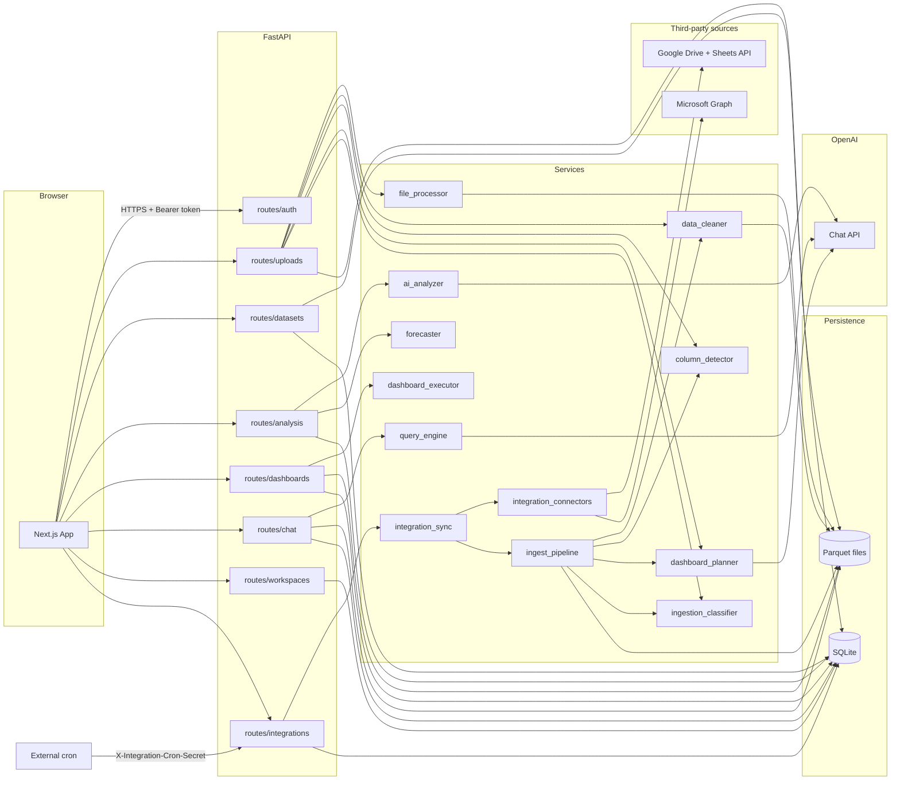

# Snaptix — Architecture & Deep Dive

This document is the **authoritative technical map** of the project: how data moves, where it lives, which APIs exist, and how AI is used. Use it to onboard, debug, or answer stakeholder questions.

---

## 1. Product mental model (one paragraph)

Users sign in with Google, pick a **workspace** (isolated container), and bring in **tabular data** two ways: by uploading **files** (Excel/CSV/TSV), or by **connecting a live source** — a Google Sheet or a Microsoft 365 workbook, over OAuth (§7.7). Both paths converge on the same ingest. The backend **cleans** rows, **infers column roles** (date, revenue-like, category, etc.), stores **metadata in SQLite** and **cleaned rows as Parquet on disk**, and optionally builds a **dashboard plan** (KPIs + charts). The UI shows **per-dataset** dashboards, **AI briefings** (structured JSON from the model), **workspace overview** (rollup KPIs/charts + optional workspace-level briefing), **forecasts** (Prophet with linear fallback), and **chat** that turns questions into **pandas code** executed safely on the DataFrame.

---

## 2. Tech stack (as implemented)

| Layer | Technology |
|--------|------------|
| Frontend | Next.js (App Router), React 19, TypeScript, Tailwind CSS v4, shadcn/ui (Base UI), TanStack Query, Recharts, next-themes |
| Auth | NextAuth.js (Google provider); session in browser |
| Backend | FastAPI, SQLAlchemy, Pandas, PyArrow/Parquet, OpenAI Python SDK |
| Database | SQLite by default (`DATABASE_URL`); PostgreSQL-compatible via SQLAlchemy URL |
| File storage | Local directory `UPLOAD_DIR` (default `./data/uploads`); original file + `{upload_id}_cleaned.parquet` |
| AI | OpenAI chat completions (`OPENAI_MODEL`, default `gpt-4o`); JSON responses for analysis and chat pipeline |
| Integrations | `httpx` for provider calls; OAuth2 authorization-code + refresh against **Google Drive/Sheets** and **Microsoft Graph**; stored credentials sealed with Fernet (`cryptography`) |

Deployment targets mentioned in older docs (Vercel/Railway) are **not enforced in code**—configure via hosting.

---

## 3. High-level system diagram

```mermaid
flowchart LR
  subgraph client [Browser]
    Next[Next.js App]
  end
  subgraph api [FastAPI]
    RU[routes/uploads]
    RD[routes/datasets]
    RA[routes/analysis]
    RDb[routes/dashboards]
    RC[routes/chat]
    RW[routes/workspaces]
    RAuth[routes/auth]
    RI[routes/integrations]
  end
  subgraph services [Services]
    FP[file_processor]
    DC[data_cleaner]
    CD[column_detector]
    DP[dashboard_planner]
    IC[ingestion_classifier]
    AA[ai_analyzer]
    QE[query_engine]
    FC[forecaster]
    DE[dashboard_executor]
    IP[ingest_pipeline]
    IS[integration_sync]
    ICon[integration_connectors]
  end
  subgraph persist [Persistence]
    SQL[(SQLite)]
    FS[(Parquet files)]
  end
  subgraph ai [OpenAI]
    GPT[Chat API]
  end
  subgraph providers [Third-party sources]
    GD[Google Drive + Sheets API]
    MG[Microsoft Graph]
  end

  Next -->|HTTPS + Bearer token| RAuth
  Next --> RU & RD & RA & RDb & RC & RW & RI
  Cron[External cron] -->|X-Integration-Cron-Secret| RI
  RU --> FP & DC & CD & DP & IC
  RD --> FS
  RA --> AA & FC
  RDb --> DE & FS
  RC --> QE & FS
  RI --> IS
  IS --> ICon & IP
  IP --> DC & CD & DP & IC
  ICon --> GD & MG
  AA --> GPT
  QE --> GPT
  DP --> GPT
  RU & RD & RA & RDb & RC & RW & RI --> SQL
  FP & DC & IP --> FS
```

---

## 4. Authentication & workspace scoping

### 4.1 Frontend

1. User signs in with **Google** (or email OTP) via NextAuth (`frontend/src/lib/auth.ts`, `app/api/auth/[...nextauth]/route.ts`).
2. On sign-in, NextAuth obtains a signed **FastAPI access token**:
   - OTP / test-login: returned from `/api/auth/otp/verify` or `/api/auth/test-login`.
   - Google / dev-bypass: NextAuth jwt callback calls **`POST /api/auth/bootstrap`** server-side with `X-Internal-Auth-Secret` (never from the browser).
3. The token is stored on the NextAuth JWT/session as `accessToken`.
4. `setApiAccessToken` (`frontend/src/lib/api.ts`) attaches **`Authorization: Bearer <token>`** on every API call.
5. `WorkspaceProvider` calls **`POST /api/auth/sync`** (Bearer-authenticated) to load workspaces / onboarding state.

### 4.2 Backend

- `deps.get_current_user` verifies the **Bearer JWT** (`API_JWT_SECRET`), then loads `User` by `sub` (user id). Spoofable `X-User-Email` is ignored.
- `deps.require_user` → 401 if missing/invalid token.
- `deps.require_active_workspace` → 400 if user has no `active_workspace_id` or workspace is not owned by user.

**Implication:** Knowing a user’s email is no longer enough to call the API. Tokens expire (`API_JWT_EXPIRE_HOURS`, default 14 days).

### 4.3 Workspace rules

- All dataset/upload/dashboard/chat/analysis operations (except a few read helpers) use **`require_active_workspace`** so rows are **scoped to the active workspace**.
- Join path: `Upload.workspace_id` → `Dataset.upload_id`. Listing datasets uses `dataset_upload_pairs_for_workspace` (`backend/services/workspace_query.py`).

---

## 5. Persistence: database schema

ORM: `backend/models/models.py`.

| Table | Role |
|-------|------|
| **users** | `email` (unique), `name`, `image`, `active_workspace_id` (FK logical to workspaces) |
| **workspaces** | `name`, `owner_id` → users |
| **uploads** | Original file metadata: `filename`, `file_type`, **`file_url` (absolute path to saved file)**, `user_description`, `status`, row/column counts, **`workspace_id`** |
| **datasets** | One per successful upload: `name`, **`schema_json`** (column detector output), **`data_summary`** (aggregates JSON), **`cleaned_report_json`**, **`dashboard_plan_json`** (optional AI/heuristic plan), **`business_classification`** (ingestion classifier id), **`integration_id`** (set when the dataset is fed by a connected source), **`dashboard_plan_locked`** (keep the existing chart layout across refreshes) |
| **analyses** | Each run: `dataset_id`, `type` (`overview` = per-dataset briefing, **`workspace_overview`** = whole-workspace briefing—see §7.4 quirk), `result_json`, `ai_summary` |
| **dashboards** | Table exists; not all features may be driven from UI—check routes if extending |
| **chat_messages** | Persists `user` / `assistant` turns per `dataset_id` (even workspace chat stores under a dataset in multi-df path—see chat route) |
| **dataset_relations** | Cross-dataset link metadata; **backend routes exist**; **frontend does not call relations APIs today** |
| **workspace_recurring_summaries** | Workspace-scoped **weekly** / **monthly** executive digests: `period_start`/`period_end`, JSON **`content_json`** (headline, key changes, risk, opportunity, actions), **`email_html_snapshot`** + **`email_sent_at`** reserved for future transactional email (no sender implemented yet); unique on `(workspace_id, kind, period_start)` |
| **workspace_timeline_snapshots** | Append-only **history** for the workspace: `event_type` (`upload` \| `briefing` \| `append`), optional **`ref_id`** / **`dataset_id`**, **`metrics_json`** (row totals + revenue KPI extracts), optional **`themes_json`** (briefing headlines / theme buckets for recurrence); one-time **backfill** on startup fills missing rows from existing uploads and `workspace_overview` analyses |
| **data_source_integrations** | One **connected source** per row: `provider` (`google_sheets`, `excel_onedrive`, …), `name`, `connection_mode` (`oauth` \| `export_url` \| `api_key` \| `service_account`), **`config_json`** (provider credentials + selected file/tab, **encrypted at rest**—see §7.7), `dataset_id` (the dataset it feeds), `refresh_interval_hours`, `auto_analyze`, `dashboard_plan_locked`, `status` (`pending` \| `active` \| `syncing` \| `error` \| `disconnected`), `last_sync_at`, `next_sync_at`, `last_sync_error`, **`syncing_started_at`** (sync heartbeat; a stale value marks a crashed run as reclaimable) |
| **integration_oauth_sessions** | **Short-lived** handoff between a provider's OAuth callback and the user confirming which file(s) to connect: `provider`, `user_email`, **`payload_json`** (freshly issued provider tokens + listed files, encrypted like `config_json`), `expires_at` (**1 hour**). Lives in the DB rather than process memory because the callback and the confirmation are separate requests that can land on different workers. Consumed single-use and pruned opportunistically |

**Migrations:** **Alembic** (`backend/migrations/`) is the schema source of truth; `main.py` lifespan runs `command.upgrade(cfg, "head")` when `RUN_MIGRATIONS_ON_STARTUP` is true, otherwise it logs that an external migrate step is expected. Startup also runs a one-time timeline-snapshot backfill and, outside production, a heuristic backfill for legacy `uploads.workspace_id` NULLs (`BACKFILL_ORPHAN_UPLOAD_WORKSPACES`).

---

## 6. Persistence: filesystem

Under `UPLOAD_DIR` (default `backend/data/uploads/`):

| File | Purpose |
|------|---------|
| `{upload_id}{ext}` | Original upload (e.g. `.csv`) |
| `{upload_id}_cleaned.parquet` | **Canonical working copy** for dashboards, chat, forecast, append |

Almost all analytics **reload Parquet**, not the original Excel, so cleaning steps are stable.

---

## 7. Core pipelines (step-by-step)

### 7.1 Upload → dataset (happy path)

**API:** `POST /api/uploads/` (multipart: `file`, `description`). Responses: **413** over size cap, **429** when rate-limited.

**Steps (`backend/routes/uploads.py`):**

1. Per-user **rate limit** (`upload_rate_limit`), then validate extension against `settings.ALLOWED_EXTENSIONS` (`.xlsx`, `.xls`, `.csv`, `.tsv`).
2. Create `Upload` row (`processing`), stream bytes to `{upload_id}{ext}` with a hard stop at `MAX_FILE_SIZE_MB` (discard row + file if exceeded).
3. `FileProcessor.read` → Pandas DataFrame.
4. `DataCleaner.clean` → cleaned `df` + `clean_report` (steps, shapes).
5. `ColumnDetector.detect` → `metadata` (lists: `date_columns`, `revenue_columns`, `category_columns`, `numeric_columns`, `text_columns`).
6. `ColumnDetector.summary` → numeric aggregates (e.g. `{col}_total`, `{col}_mean`, top category counts) stored as **`data_summary`** JSON.
7. `DashboardPlanner.build_plan` → JSON plan (KPIs + charts + optional `dataset_brief`); may call OpenAI when configured.
8. `build_ingestion_profile` → UI-facing **`ingestion`** object (classification, flags, interpretations).
9. Save `Dataset` with JSON fields; `df.to_parquet` cleaned file.
10. Commit; return `dataset_id`, `ingestion`, `all_columns`, etc.

**Frontend:** `FileDropzone` → `api.uploadFile` → review cards → `PATCH /api/datasets/{id}` to set `business_classification`, primary date/amount, segment columns (updates schema + may rebuild plan—see `datasets.py`).

### 7.2 Per-dataset dashboard (KPIs + charts)

**API:** `GET /api/dashboards/dataset/{dataset_id}?start_date=&end_date=&last_n_days=`

**Flow (`backend/routes/dashboards.py` + services):**

1. Load Parquet; parse `schema_json`.
2. Optional **date filter**: `last_n_days` anchors on **max date in file** (not wall-clock “today”).
3. If `dashboard_plan_json` exists and has charts → **`execute_plan`** builds KPIs + chart payloads from the (possibly filtered) `df`.
4. Else → **`legacy_charts`** + **`fallback_ui_kpis`**.
5. Response includes `filtered_row_count`, `timeframe` meta, `date_bounds`, `daily_aggregates`, etc.

**Frontend:** Dataset page `Overview` tab; `TimeframeToolbar` maps presets to query params (`frontend`).

### 7.3 Per-dataset AI briefing

**API:** `POST /api/analysis/run` body `{ "dataset_id": "..." }`  
**Fetch latest:** `GET /api/analysis/dataset/{dataset_id}`

**Flow (`backend/routes/analysis.py` + `services/ai_analyzer.py`):**

1. Load `data_summary` + `schema_json` + optional `user_description`.
2. **`AIAnalyzer.analyze`** sends statistical summaries to the model with a strict **JSON-only** system prompt (executive summary, `top_priorities`, `key_metrics`, `insights`, `anomalies`, `recommendations`).
3. If `OPENAI_API_KEY` is empty → **`_fallback_analysis`** heuristic JSON (no model).
4. Persist `Analysis` with `type="overview"`.

**Frontend:** `AnalysisPanel` normalizes and renders signals, conviction, trace UI (`frontend/src/components/dashboard/analysis-panel.tsx`, `analysis-normalize.ts`).

### 7.4 Workspace overview AI (quirk)

**API:** `POST /api/analysis/overview/run`  
**Latest:** `GET /api/analysis/overview/latest`

**Flow:**

1. Load **all** datasets in workspace; merge each `data_summary` into `combined_summary.datasets[]`.
2. Merge column lists in `combined_metadata` (concatenation of names—**not** a SQL join).
3. Call **`AIAnalyzer.analyze`** with workspace-level description string.
4. **Storage quirk:** `Analysis` row uses `type="workspace_overview"` but **`dataset_id` is set to the first dataset’s id** in the loop (implementation detail for ORM constraint). The UI treats this as workspace-scoped via `overview/latest`, not via `dataset_id`.

### 7.5 Forecasting

**Per dataset:** `POST /api/analysis/forecast` — loads Parquet, picks `date_column` / `value_column` from request or first entries in `schema_json`, runs **`Forecaster.forecast`** (Prophet when enough history and `FORECAST_ENGINE=prophet`, else linear regression; confidence bands).

**Workspace outlook:** `POST /api/analysis/overview/forecast` — picks the **largest dataset by row count** that has both date and revenue columns; uses **first** date + **first** revenue column of that schema.

### 7.6 Chat (natural language → pandas → explanation)

**Single dataset:** `POST /api/chat` `{ dataset_id, question }`  
**Workspace:** `POST /api/chat/workspace` `{ question }`

**Flow (`services/query_engine.py`):**

1. Load prior **`chat_messages`** for this thread (single-dataset vs workspace threads are separated: workspace user lines are stored with prefix **`[All Datasets] `** on the anchor dataset). Up to **12** prior (user, assistant) pairs feed into the model as conversation context.
2. Load Parquet(s); build schema description for the model.
3. **Pass 1:** Model returns JSON with `pandas_code` assigning to `result` (messages include prior Q&A + fresh schema block on the latest user turn).
4. **Safety:** forbidden tokens (`import`, `exec`, etc.) rejected; code run in restricted namespace with **`SAFE_BUILTINS`** + `df` (or multiple `df_*` / `datasets` dict for workspace).
5. **Pass 2:** Model explains result JSON → `answer` and optional `chart_data` (includes a trimmed slice of prior turns).
6. New user + assistant rows appended to **`chat_messages`**.

If no API key, chat degrades (engine checks `self.client`).

### 7.7 Connected source → dataset (integration sync)

The second way data arrives. A **connected source** (`data_source_integrations`) owns one dataset and re-reads it on demand or on a schedule, so dashboards, briefings, forecasts and chat all work on it exactly as they do on an uploaded file.

**Wave one is `google_sheets` + `excel_onedrive` over OAuth.** The rest of `services/integration_registry.py` (Stripe, Shopify, HubSpot, GA4, Postgres, …) is a visible roadmap whose modes report `available: false`; the catalog and the write path check the same flag, so a hand-rolled request is refused the same way a hidden button is.

**Connect (OAuth), `backend/routes/integrations.py`:**

1. `POST /api/integrations/oauth/start` returns the provider's authorize URL. Connection intent (workspace, name, refresh interval, `auto_analyze`, `dashboard_plan_locked`) travels in a **signed `state`** — HMAC-SHA256 with `INTEGRATION_OAUTH_STATE_SECRET`, 15-minute expiry — so nothing has to be stored before consent.
2. The provider redirects to **`GET /api/integrations/oauth/callback/{google|microsoft}`** on the **API** host (not the web app). The route verifies `state`, exchanges the code for tokens, lists the account's spreadsheets, writes an **`integration_oauth_sessions`** row, and **303**s the browser to `FRONTEND_APP_URL/integrations?oauth_session=<id>`. Errors here render HTML, since there is no JSON client on the other end of a browser redirect.
3. The UI reads the session (`GET /api/integrations/oauth/session/{id}`) and shows the file picker.
4. Google only: **`POST /api/integrations/oauth/tabs/google`** reports, per selected workbook, its tabs with a table-likeness `score`, a `suggested_tab`, and `needs_choice`. Only a workbook where **more than one** tab looks like real data is worth asking about — a cover page plus one table scores below the floor and is auto-picked. This call is read-only and does **not** consume the session, so the user can still change their selection.
5. **`POST /api/integrations/oauth/complete/google`** takes **up to 20 `item_ids`** plus an optional `sheet_names` map and creates **one source per sheet**, each with its own dataset, dashboard and schedule. The workspace cap is checked for the **whole batch** up front (connecting three of five and then failing would leave the user guessing), the session is **popped single-use** (the `DELETE`'s matched-row count decides the winner, so a double-submit cannot create duplicates), and the response returns as soon as the rows exist with first syncs running in a **background task** — clients poll `GET /api/integrations` to see `pending` clear. Microsoft's `complete/microsoft` is single-file and syncs **inline**.

**Sync (`services/integration_sync.py` → `sync_integration`):**

1. **Claim** the row with a single conditional `UPDATE` (compare-and-swap on `status`), so exactly one caller can hold it in `syncing` on both SQLite and Postgres without `SELECT … FOR UPDATE`. A `syncing` row whose `syncing_started_at` heartbeat is older than `INTEGRATION_STALE_SYNC_MINUTES` counts as abandoned and is claimable again, so a crashed worker cannot brick a connection. A losing caller gets **409**.
2. **First sync only** (`dataset_id is None`): check the plan's **upload** allowance *before* spending a network call and a model pass. Later refreshes cost no upload credit.
3. Decrypt `config_json` (see **Credentials at rest** below). On a **scheduled** run, ask the provider for a cheap **change stamp** (Drive `modifiedTime`); if it matches the stored one, finish early as `skipped` without touching the dataset — re-writing identical rows would churn the cache and make `last_sync_at` read as new data. A **manual** refresh always does the real fetch, because "nothing happened" is a worse answer to a button press.
4. **Fetch** via `fetch_provider_data`. Bodies are **streamed** and abort past `INTEGRATION_MAX_FETCH_MB`, so an oversized sheet never lands in memory. A **native Google Sheet has no downloadable bytes** and is exported as `.xlsx` (preserving multiple tabs and numeric/date typing); files merely *uploaded* to Drive come down through `alt=media`. Providers that rotate tokens mutate `config` during the fetch, so it is re-encrypted and committed straight after.
5. **Ingest** through the same `ingest_dataframe` the upload path uses, on the upload worker's executor. It **reuses the existing `Upload`/`Dataset` row** when there is one, so the dataset keeps its id, chat history and dashboard identity across refreshes; `dashboard_plan_locked` keeps the chart layout stable instead of re-planning on every sync.
6. Record a **timeline snapshot** (`append` for manual, `upload` for scheduled), then, when `auto_analyze` is on, run `run_post_sync_analysis` for a fresh briefing. Hitting the **analysis** cap is reported as `analysis_skipped_reason` ("synced, but no new briefing"), not swallowed as an error.

**Failure model:** every path other than a lost claim leaves the row in **`error`** with a readable `last_sync_error` — never stuck in `syncing` — so "Refresh now" and the scheduler can always recover it. Google's own export ceiling, a revoked grant, and a renamed tab each get their own message rather than a generic "reconnect".

**Credentials at rest (`services/integration_credentials.py`):** `config_json` and OAuth-session payloads hold live third-party secrets (Google/Microsoft **refresh** tokens, and for later waves Stripe keys and the like), so they are written as an authenticated **`enc:v1:<fernet token>`** envelope. `INTEGRATION_CREDENTIALS_KEY` accepts a comma-separated list: the **first** key encrypts, **all** are tried on decrypt, which makes rotation two deploys (`new,old` → backfill with `scripts.encrypt_integration_credentials` → `new`) instead of an outage. Anything without the prefix is read as legacy cleartext and upgraded on next write, so local development needs no setup — and **production refuses to boot** with the key unset.

**Scheduling:** unattended refresh is **off by default** (`INTEGRATION_AUTO_SYNC_ENABLED=false`) as a cost decision, and three independent things enforce it: new rows are stored with **no `next_sync_at`**, the due-query returns nothing even for rows written earlier, and `POST /api/integrations/run-scheduled` answers as an explicit no-op. When on, prefer an **external cron** hitting that endpoint with `X-Integration-Cron-Secret` over `INTEGRATION_SCHEDULER_ENABLED`, which runs a loop inside *every* API worker. See [PRODUCTION_CHECKLIST.md](PRODUCTION_CHECKLIST.md) for the per-cycle cost arithmetic and the **Google OAuth verification** requirement (`drive.readonly` is a *restricted* scope).

---

## 8. AI components compared

| Component | Input | Output | Model role |
|-----------|--------|--------|----------------|
| **AIAnalyzer** | `data_summary` dict, `schema_json` dict, optional text | Single JSON object (briefing) | One structured JSON response |
| **DashboardPlanner** | DataFrame + metadata + stats (+ description) | `dashboard_plan_json` | When `OPENAI_API_KEY` is set, calls chat completions (`OPENAI_MODEL`) for KPI/chart JSON; otherwise **heuristic** plan in code |
| **QueryEngine** | Question + DataFrame(s) + schema + optional **chat history** | `answer`, optional `chart_data` | **Two-step:** codegen JSON → execute → explain JSON; both steps see prior turns |
| **Forecaster** | DataFrame + columns | Historical fit + forward points + stats | **No LLM**; Prophet or linear regression (`FORECAST_ENGINE`) |

Prompt tone for briefing is controlled in **`backend/services/ai_analyzer.py`** (`SYSTEM_PROMPT`).

---

## 9. API catalog (concrete paths)

Prefix **`/api`** unless noted. Almost all require **`Authorization: Bearer <access_token>`** + active workspace (see §4).

### Auth & workspace

| Method | Path | Notes |
|--------|------|--------|
| POST | `/api/auth/sync` | Body: email, name, image — creates user, returns profile |
| GET | `/api/auth/me` | Profile + workspaces |
| POST | `/api/workspaces` | Create workspace |
| GET | `/api/workspaces` | List |
| POST | `/api/workspaces/{id}/activate` | Sets `user.active_workspace_id` |

### Uploads & datasets

| Method | Path | Notes |
|--------|------|--------|
| POST | `/api/uploads/` | Multipart upload + process; **413** if file exceeds `MAX_FILE_SIZE_MB`; **429** if per-user rate limits exceeded |
| GET | `/api/uploads/{id}` | Metadata |
| GET | `/api/datasets` | List in workspace |
| GET | `/api/datasets/{id}` | Schema, summary, cleaning report |
| PATCH | `/api/datasets/{id}` | Classification + primary columns + segments |
| GET | `/api/datasets/{id}/preview` | Sample rows |
| POST | `/api/datasets/{id}/append` | Append compatible file; rewrite Parquet; same **413** / **429** rules as `POST /api/uploads/` |
| DELETE | `/api/datasets/{id}` | Remove dataset + related rows/files per route logic |

### Integrations (connected sources)

Every route below except `/catalog` and the two OAuth callbacks requires Bearer + active workspace. **Connect, sync and mutate** routes additionally **503** while `INTEGRATIONS_ENABLED` is false; **listing, reading and `DELETE` stay open**, so an existing source can always be inspected or removed after the switch is turned off. A provider outside `INTEGRATION_ENABLED_PROVIDERS` is **400**. Provider fetch failures surface as **422** with a user-readable message, a lost sync claim as **409**.

| Method | Path | Notes |
|--------|------|--------|
| GET | `/api/integrations/catalog` | **No auth.** Provider catalog + `enabled` flag; off-wave providers report `available: false` per connection mode |
| GET | `/api/integrations` | Connected sources in the workspace, newest first |
| POST | `/api/integrations` | Create a non-OAuth source (`export_url` / `api_key` / `service_account`); runs the first sync inline unless `run_initial_sync: false` |
| GET | `/api/integrations/{id}` | One source |
| PATCH | `/api/integrations/{id}` | Name, connection mode, `config`, refresh interval, `auto_analyze`, `dashboard_plan_locked`. **Replaces `config` wholesale**—not the way to change a tab on an OAuth source |
| DELETE | `/api/integrations/{id}` | Disconnect |
| POST | `/api/integrations/oauth/start` | Body: provider, name, refresh interval, flags → `{ authorize_url }`. **503** if that provider's OAuth env vars are unset |
| GET | `/api/integrations/oauth/callback/google` | **No auth** (provider redirect); verifies signed `state`, exchanges tokens, lists files → **303** to `FRONTEND_APP_URL/integrations?oauth_session=…`. Renders HTML on error |
| GET | `/api/integrations/oauth/callback/microsoft` | As above, via Microsoft Graph |
| GET | `/api/integrations/oauth/session/{session_id}` | The pending handoff: provider, intended settings, and the listed files to choose from |
| POST | `/api/integrations/oauth/tabs/google` | Per selected workbook: `tabs` (with table-likeness scores), `needs_choice`, `suggested_tab`. Read-only; does **not** consume the session |
| POST | `/api/integrations/oauth/complete/google` | Body `{ session_id, item_ids[1..20], sheet_names }` → one source per sheet; returns `{ connected, integrations, syncing: true }` with first syncs in the background. Batch capacity checked up front; session is single-use |
| POST | `/api/integrations/oauth/complete/microsoft` | Body `{ session_id, item_id }` → single source, synced **inline** |
| GET | `/api/integrations/{id}/tabs` | Google Sheets only (**400** otherwise): `tabs`, `current_tab`, `suggested_tab`. Rate-limited as a provider fetch—listing tabs of an uploaded `.xlsx` downloads the workbook |
| POST | `/api/integrations/{id}/sheet` | Body `{ sheet_name }`; **merges** just that key (so OAuth tokens survive), clears the change stamp, and re-syncs immediately since the dashboard was built from the old tab |
| POST | `/api/integrations/{id}/test` | Fetch without ingesting → `row_count`, `column_count`, first 20 `columns`. Rate-limited |
| POST | `/api/integrations/{id}/refresh` | Manual sync; always does a real fetch. Rate-limited |
| POST | `/api/integrations/run-scheduled` | **No user auth**—requires `X-Integration-Cron-Secret` (**403** on mismatch, **503** when `INTEGRATION_CRON_SECRET` is unset). Returns `{ synced, due_remaining, auto_sync_enabled }`, or an explanatory no-op while auto-sync is off |

### Analysis & dashboards

| Method | Path | Notes |
|--------|------|--------|
| POST | `/api/analysis/run` | Per-dataset briefing |
| GET | `/api/analysis/dataset/{dataset_id}` | Latest analysis or null |
| GET | `/api/analysis/{analysis_id}` | By id (less used from UI) |
| POST | `/api/analysis/forecast` | Per-dataset forecast |
| POST | `/api/analysis/overview/run` | Workspace briefing |
| GET | `/api/analysis/overview/latest` | Latest workspace briefing |
| POST | `/api/analysis/overview/forecast` | Workspace outlook chart data |
| GET | `/api/dashboards/dataset/{dataset_id}` | KPIs + charts + timeframe + **`what_changed`** (current vs previous window; respects `last_n_days` / `start_date` / `end_date`) |
| GET | `/api/dashboards/overview` | Cross-dataset KPIs + charts; **`what_changed`** …; **`alerts`** …; **`recommended_actions`** …; **`habit_hints`** …; **`usage`** (plan label, monthly analysis/upload meters, history-depth summary, soft upgrade **`nudges`**) |
| GET | `/api/summaries/latest` | Active workspace; query `ensure` (default true) creates missing digests for **last full ISO week** and **prior calendar month**; returns stored **`weekly`** / **`monthly`** payloads + email-prep fields |
| GET | `/api/summaries/history?kind=&limit=` | Past stored summaries for comparison |
| POST | `/api/summaries/generate` | Body `{ "kind": "weekly"\|"monthly", "force": bool }` rebuilds the canonical period |
| GET | `/api/workspace/timeline` | Timeline events (newest first), **`evolution`** (recurring briefing themes, improving KPIs vs prior snapshot), and **`digests`** (stored weekly/monthly summary headlines) |
| GET | `/api/workspace/timeline/compare` | Query `from` / `to` snapshot ids → row delta + overlapping KPI % changes |

### Chat

| Method | Path | Notes |
|--------|------|--------|
| POST | `/api/chat` | Single dataset; uses prior non–workspace messages on same `dataset_id` |
| POST | `/api/chat/workspace` | Multi-dataset; prior turns stored on first dataset with `[All Datasets] ` user prefix |
| GET | `/api/chat/history/{dataset_id}` | Optional query `workspace=true` for workspace-only thread; requires workspace membership |

### Billing (Razorpay)

| Method | Path | Notes |
|--------|------|--------|
| POST | `/api/billing/razorpay/checkout` | Body `{ "tier": "starter" \| "pro" }`; requires Bearer token. Returns `{ key_id, subscription_id, short_url }` (`key_id` + `subscription_id` drive Razorpay Standard Checkout on `/pricing`; Razorpay POSTs to `/api/billing/razorpay/callback` → redirect `/pricing/success` → dashboard). `short_url` only if `NEXT_PUBLIC_RAZORPAY_HOSTED_CHECKOUT=true`. Otherwise **503**. |
| POST | `/api/billing/razorpay/verify-checkout` | After successful Checkout: body `{ razorpay_payment_id, razorpay_subscription_id, razorpay_signature }`; requires Bearer token. Confirms HMAC, then sets `user.subscription_plan` from Razorpay subscription notes/plan id. Returns `{ verified: true, subscription_plan }` or **400**. Webhooks remain a backup. |
| POST | `/api/billing/razorpay/webhook` | **No auth.** Raw POST body + `X-Razorpay-Signature` (HMAC-SHA256 with `RAZORPAY_WEBHOOK_SECRET`). Use `X-Razorpay-Event-Id` (or payload `id`) for idempotency in `billing_webhook_events`. Subscription **activated** / **charged** / **resumed** (status `active`) sets `subscription_plan` from notes or plan id; **cancelled** / **completed** / **halted** / **expired** downgrades to `free`. |

### Other

| Method | Path | Notes |
|--------|------|--------|
| GET | `/health` | No auth |
| — | `/api/relations/*` | Implemented in backend; **no frontend usage found** |

The **single source of truth for client calls** is `frontend/src/lib/api.ts` (`api` object).

**Subscriptions & enforcement:** Each `User` has `subscription_plan` (`free` \| `starter` \| `pro`, default `free`), migrated on startup via `main.py`. Billing fields: `billing_provider` (`razorpay` when using this integration), `billing_customer_id`, `billing_subscription_id`, `subscription_current_period_end` (from webhook `current_end` when present). Checkout is implemented in `backend/services/razorpay_service.py` + `routes/billing.py`; the **`/pricing`** page calls `POST /api/billing/razorpay/checkout` for paid tiers when the user is signed in. After payment, Razorpay sends webhooks to **`/api/billing/razorpay/webhook`** (public URL required—ngrok/Cloudflare Tunnel in dev). Env: `RAZORPAY_KEY_ID`, `RAZORPAY_KEY_SECRET`, `RAZORPAY_WEBHOOK_SECRET`, `RAZORPAY_PLAN_STARTER`, `RAZORPAY_PLAN_PRO`, optional `RAZORPAY_SUBSCRIPTION_TOTAL_COUNT` (default 60 billing cycles). `FORCE_SUBSCRIPTION_PLAN` in backend `.env` overrides effective plan for QA (leave empty in production). Caps live in `backend/services/subscription_usage.py`: **Free** = lifetime uploads (2), analyses (2), chat (3); **Starter** = 10 uploads & 15 analyses per workspace/month, 50 chat/month; **Pro** = 30 uploads & 50 analyses per workspace/month, 200 chat/month. **403** `plan_limit` shape is in `backend/services/plan_limits.py`. Overview feature gating: **Free** hides “what changed” and alerts; **Starter** has no weekly summaries or alerts; **Pro** is full. Timeline requires Starter+.

---

## 10. Frontend map (routes → data)

| Area | Route(s) | Primary APIs |
|------|-----------|----------------|
| Landing | `/`, `/pricing` | `/pricing` paid CTAs → `POST /api/billing/razorpay/checkout` when logged in |
| Login | `/login` | NextAuth |
| Onboarding | `/onboarding` | `POST /api/workspaces` |
| Overview | `/dashboard` | `GET /api/dashboards/overview` (incl. `recommended_actions`, `usage`, `habit_hints`), `GET/POST` overview analysis & forecast, `GET /api/summaries/latest` |
| History | `/history` | `GET /api/workspace/timeline`, `GET /api/workspace/timeline/compare` |
| Upload | `/upload` | `POST /api/uploads/` |
| Sources list | `/datasets` | `GET /api/datasets`, `DELETE` |
| Integrations | `/integrations` | `GET /api/integrations/catalog`, `GET /api/integrations`, `POST .../oauth/start`, `GET .../oauth/session/{id}` (read on return from the provider via `?oauth_session=`), `POST .../oauth/tabs/google`, `POST .../oauth/complete/{google,microsoft}`, `POST /api/integrations`, `POST .../{id}/refresh`, `DELETE` |
| Dataset hub | `/datasets/[id]` | `GET` dataset, preview, `GET` dashboard data, `GET/POST` analysis, forecast, `PATCH` dataset; **`POST /api/integrations/{id}/refresh`** when the dataset is fed by a connected source |
| Chat page | `/chat` | `GET /api/datasets`, `POST /api/chat` |
| Floating chat | `ChatOverlay` on overview | `POST /api/chat` or `/api/chat/workspace` |

State: **TanStack Query** caches server data; **WorkspaceContext** holds profile + active workspace; theme via **next-themes**.

---

## 11. Worked example (narrative)

**Goal:** New user gets a workspace briefing after one CSV upload.

1. User logs in → sync creates `users` row → onboarding creates `workspaces` row → activate sets `active_workspace_id`.
2. User uploads `sales_q3.csv` → `uploads` + `datasets` rows; files `abc.csv` + `abc_cleaned.parquet`; `schema_json` marks `order_date`, `amount`.
3. User confirms ingestion in UI → optional `PATCH` adjusts `primary_date_column` / `primary_amount_column` → backend may rebuild `dashboard_plan_json` and `data_summary`.
4. Dataset **Overview** tab calls `GET /api/dashboards/dataset/{id}` → sees KPIs/charts from plan or legacy.
5. User opens **Briefing** tab → `POST /api/analysis/run` → `analyses` row; UI shows `AnalysisPanel`.
6. User opens **Overview** (workspace) → `POST /api/analysis/overview/run` merges summaries from all datasets → new `workspace_overview` analysis; tiles and collapsible full panel use `result_json`.

---

## 12. Configuration & limits

| Variable / setting | Meaning |
|--------------------|---------|
| `DATABASE_URL` | SQLAlchemy URL |
| `UPLOAD_DIR` | Where originals + Parquet live |
| `OPENAI_API_KEY` | If empty: briefing uses **fallback** JSON; chat/query planner disabled or degraded |
| `OPENAI_MODEL` | Chat model id |
| `MAX_FILE_SIZE_MB` | **20** by default; server streams uploads and rejects larger bodies with **413**; frontend `upload-config.ts` should stay in sync |
| `UPLOAD_RATE_BURST_PER_MINUTE` | Max uploads per user per rolling minute (default **5**); **429** when exceeded |
| `UPLOAD_RATE_MAX_PER_HOUR` | Max uploads per user per rolling hour (default **30**); **429** when exceeded |
| `INTEGRATION_MAX_FETCH_MB` | **50** by default; the sync-side counterpart to `MAX_FILE_SIZE_MB`. Provider downloads are streamed and abort once the body passes this, so an oversized sheet never reaches memory. Uploads are capped at 20 MB; a machine-generated export is allowed to be bigger |
| `INTEGRATION_FETCH_BURST_PER_MINUTE` | Max provider fetches per user per rolling minute (default **5**); **429** when exceeded. Covers `refresh` / `test` / `tabs` |
| `INTEGRATION_FETCH_MAX_PER_HOUR` | Max provider fetches per user per rolling hour (default **30**); **429** when exceeded |
| `INTEGRATIONS_ENABLED` | **Master switch, default `false`.** While off, every connect/refresh/patch route returns **503** and the UI shows "coming soon". Reads (`catalog`, list) stay available |
| `INTEGRATION_ENABLED_PROVIDERS` | Comma-separated allow-list, default **`excel_onedrive,google_sheets`**. Ships a wave without dragging every built-but-unreviewed connector live. Empty = allow every provider whose connector is available. Enforced on the write path, not just in the catalog |
| `INTEGRATION_DEFAULT_REFRESH_HOURS` | **24**. Requested intervals are clamped to `INTEGRATION_MIN_REFRESH_HOURS` (**1**) … `INTEGRATION_MAX_REFRESH_HOURS` (**168**) |
| `INTEGRATION_AUTO_SYNC_ENABLED` | **Default `false`:** sources refresh only when a user asks. See §7.7 for the three independent stops this implies |
| `INTEGRATION_SCHEDULER_ENABLED` | In-process scheduler loop (interval `INTEGRATION_SCHEDULER_INTERVAL_SECONDS`, default **60**). Only consulted when auto-sync is on, and it runs in **every** API worker—prefer external cron |
| `INTEGRATION_STALE_SYNC_MINUTES` | **30**. A row held in `syncing` longer than this is treated as a crashed run and becomes claimable again |
| `INTEGRATION_MAX_PER_WORKSPACE` | **10** connected sources, independent of plan tier; bounds worst-case fetch + LLM volume |
| `INTEGRATION_CRON_SECRET` | Shared secret for `POST /api/integrations/run-scheduled` (`X-Integration-Cron-Secret`). Empty → that route **503**s; **required in production** |
| `INTEGRATION_CREDENTIALS_KEY` | Fernet key(s) encrypting stored integration credentials. First encrypts, all are tried on decrypt (`new,old` enables rotation). Empty leaves them cleartext, which **production boot refuses** |
| `INTEGRATION_OAUTH_STATE_SECRET` | Signs the OAuth `state` carrying connection intent across the provider round trip |
| `FRONTEND_APP_URL` | Where the OAuth callback sends the browser back (default `http://localhost:3000`). Production boot **refuses** empty, localhost, or non-https—otherwise connect succeeds server-side and strands the user on a dead page |
| `GOOGLE_CLIENT_ID` / `GOOGLE_CLIENT_SECRET` / `GOOGLE_REDIRECT_URI` | **Backend** Google OAuth for the Sheets connector—*separate* from the frontend's NextAuth sign-in credentials (different scopes, different consent, redirect lands on the **API**). Unset → `oauth/start` **503**s for that provider |
| `MICROSOFT_CLIENT_ID` / `MICROSOFT_CLIENT_SECRET` / `MICROSOFT_TENANT_ID` / `MICROSOFT_REDIRECT_URI` | Same, for Excel / OneDrive via Microsoft Graph (`offline_access User.Read Files.Read`) |
| `RUN_MIGRATIONS_ON_STARTUP` | Run Alembic `upgrade head` in the lifespan; set false to use an external migrate step |
| `ALLOWED_EXTENSIONS` | Default spreadsheet types only. Gates **uploads**; a connected source is read through its provider and bounded by `INTEGRATION_MAX_FETCH_MB` instead |
| `CORS_ORIGINS` | Comma-separated; must include frontend origin when using cookies/credentials |
| `API_JWT_SECRET` | Signs FastAPI Bearer access tokens (override in production) |
| `API_JWT_EXPIRE_HOURS` | Token lifetime (default **336** = 14 days) |
| `INTERNAL_AUTH_SECRET` | Shared with frontend (server-only) for Google/bootstrap minting |
| `SUBSCRIPTION_PLAN` | `free` (default), `starter`, or `pro`—drives **`usage`** meters on the workspace overview (soft UI only until billing enforces) |

Frontend: `NEXT_PUBLIC_API_URL`, NextAuth env vars (`GOOGLE_CLIENT_*`, `NEXTAUTH_SECRET`, `NEXTAUTH_URL`), and server-only **`INTERNAL_AUTH_SECRET`** (must match backend).

---

## 13. What this document does *not* claim

- **Multi-tenant isolation** beyond workspace id + owner check (no row-level security in DB).
- **PDF ingest** (not in `ALLOWED_EXTENSIONS`).
- **Integrations beyond wave one.** Google Sheets and Excel/OneDrive are implemented over OAuth (§7.7); everything else in the provider catalog reports itself unavailable. Some are deliberately held back for cause—Postgres and Salesforce until their user-supplied hosts are checked against the SSRF blocklist, warehouse tiers until reviewed.
- **A launched Google integration.** The connector works, but `drive.readonly` is a Google **restricted** scope: unverified apps are capped at 100 users behind a warning screen, and verification (plus possibly an annual CASA assessment) is a prerequisite for public launch, not a config flag. See [PRODUCTION_CHECKLIST.md](PRODUCTION_CHECKLIST.md).
- **Unattended refresh being on.** `INTEGRATION_AUTO_SYNC_ENABLED` ships `false`; nothing syncs without a user action until someone does the cost arithmetic and turns it on.
- **Production hardening beyond current upload limits** (virus scan, Redis-backed rate limits for multi-worker, reverse-proxy `limit_req`)—evaluate before a wide public launch. Integration fetch limits share the same per-process rate-limit caveat.

---

## 14. Suggested extensions to documentation

If the repo grows, split into:

- `docs/ARCHITECTURE.md` (this file — stays the overview)
- `docs/API.md` (OpenAPI export from FastAPI `/docs` + examples)
- `docs/AI.md` (prompt versions, eval notes)

For **OpenAPI**, run the backend and use FastAPI’s automatic `/docs` / `openapi.json`.

---

## 15. Roadmap ideas (product, not committed)

See older bullet lists in git history or product docs; common next steps: team workspaces, PDF ingest, background jobs, stronger API auth, relations UI wired to `dataset_relations`.
