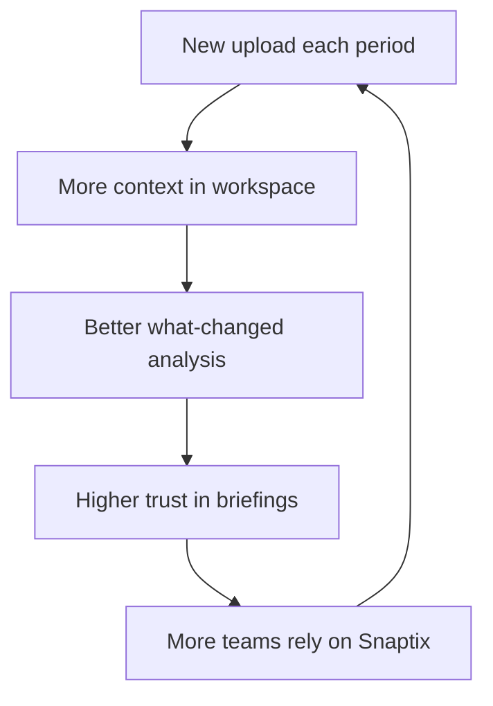

# Snaptix Pitch Story

**Tagline:** Turn spreadsheet noise into decisions you can act on.

---

## 1) The Problem We Solve

- Most businesses run on spreadsheets, but decisions still run on guesswork.
- Teams spend days cleaning files, aligning metrics, and preparing one review.
- Generic AI tools sound smart but cannot retain business context month to month.
- BI tools are powerful but heavy, slow to set up, and hard for non-analysts.

**The cost:** slower decisions, delayed course-correction, and missed growth windows.

---

## 2) The Future We Build

- Upload your files once.
- See dashboards instantly.
- Get executive briefings in plain English.
- Ask questions and get answers tied to real numbers.
- Track what changed each period.
- Decide faster with less noise.

---

## 3) Product Promise (One Slide)

Snaptix is the AI business analyst for spreadsheet-first teams.  
It turns Excel and CSV files into dashboards, briefings, forecasts, and decision-ready actions.

---

## 4) Why Snaptix Wins vs Generic AI

| What teams need | Generic AI | Snaptix |
|---|---|---|
| Persistent business memory | Starts fresh every session | Workspace history across uploads |
| Answers grounded in data | Often summary-style text | Query pipeline executes on real data |
| Actionable briefings | Long prose, mixed quality | Structured priorities, risks, actions |
| Time-aware monitoring | Manual re-asking every month | What changed, timeline, recurring digests |
| Spreadsheet-native workflow | Requires copy/paste context | Direct upload, cleaning, schema detection |

---

## 5) The Experience in 30 Seconds

1. A founder uploads sales, cost, and ops spreadsheets.
2. Snaptix auto-detects core columns and builds dashboards.
3. AI briefing explains risks, opportunities, and confidence.
4. User asks, "Why did margin drop this month?"
5. Snaptix runs safe analysis on the dataset and returns a clear answer.
6. Team exports and shares the dashboard with actions for the week.

---

## 6) Visual: From Upload to Decision

---

## 7) Visual: Why Customers Stay

---

## 8) Core Differentiators (Investor-Ready)

- **Spreadsheet-native from day one:** no warehouse migration required.
- **Grounded AI loop:** code-backed answers, not only language-backed responses.
- **Operator-grade output:** concise priorities, not generic BI commentary.
- **Continuity over novelty:** timeline, comparisons, and recurring summaries.
- **Fast time-to-value:** meaningful output within minutes of first upload.

---

## 9) Who Needs This Most

- Founder-led businesses running monthly business reviews.
- Finance and RevOps teams juggling multiple data exports.
- Agencies managing reporting for multiple client workspaces.
- Operators who need answers now, not BI implementation projects.

---

## 10) Business Impact We Drive

- Cut reporting prep time from days to minutes.
- Reduce decision lag by making tradeoffs visible early.
- Improve team alignment with one shared source of narrative.
- Increase confidence in planning through explainable, repeatable analysis.

---

## 11) 10-Second Pitch

Snaptix is the AI business analyst for spreadsheet-first teams.  
We convert raw Excel and CSV files into dashboards, executive briefings, and grounded answers, so teams can make faster, better decisions every week.

---

## 12) 30-Second Pitch

Most teams already have the data, but it is trapped in scattered spreadsheets and disconnected reports.  
Snaptix turns that raw data into a live decision workspace: automated dashboards, plain-English briefings, forecasting, and natural-language querying backed by real computation.  
Instead of rebuilding analysis every month, teams track what changed, understand why, and know what action to take next.

---

## 13) One-Line Alternatives (Use Anywhere)

- "ChatGPT talks about data. Snaptix runs on your business data."
- "From spreadsheet chaos to board-ready clarity."
- "Your weekly business review, automated and always current."
- "Upload once, decide better every week."

---

## 14) Suggested Final Slide (CTA)

**Headline:** Stop reporting. Start deciding.  
**Subtext:** Turn spreadsheet noise into the clearest weekly decisions your team makes.  
**CTA:** Start with one upload. Leave with one clear action plan.

